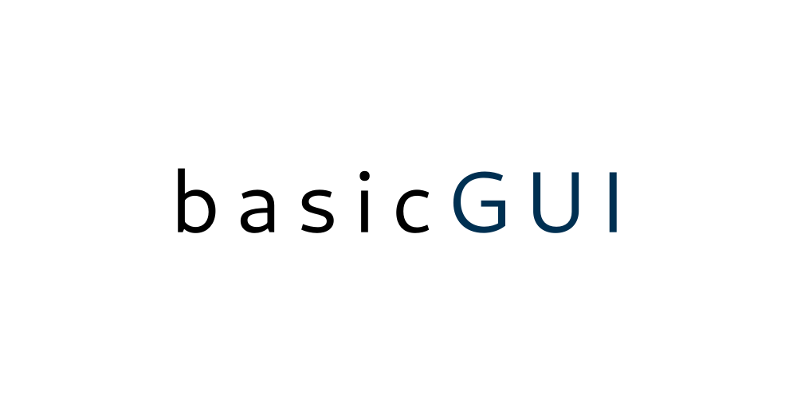
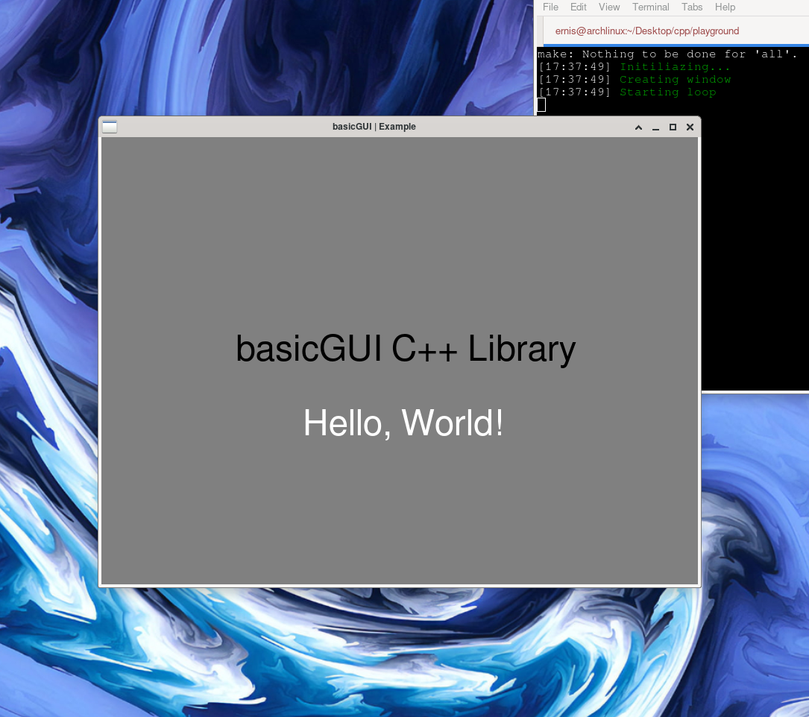

<br>


<h1>About</h1>

<p><b>basicGUI - C++ Library for Graphical User Interface</b></p>
<p>basicGUI lets developers to create <b>fast</b>, <b>easy</b> and <b>light</b> applications.</p>


# Preview




<h1>Documentation</h1>

Click here to see <a href="basicGUI/src/branch/main/docs/docs.md">documentation</a>

<h2>Code snippet</h2>

from examples folder

```c++
#include <basic.hpp>
using namespace basic;

int main(){
	basic_INFO("Initiliazing...");
	
	/* Initializing GLFW, setting windowsHints and checking for errors */
    basicWindow::basicSet();

    basic_INFO("Creating window");
    /* Creating window, initialazing glad and checking for errors */
    basicWindow::basicCreate(800, 600, "basicGUI | Example", 0, 1);

    /* Starting loop */
    basic_INFO("Starting loop");

    while(basicWindow::basicRun()){

        /* kill key - ESC*/
        basicWindow::basicInput();

        /* Changing background color */
        /* RED, GREEN, BLUE, ALPHA*/
        basicBackground::basicBackgroundColor("gray");

        basicText::basicRText("basicGUI C++ Library", 48, 180.0f, 300.0f, 1.0f, "black", "freesans", 800, 600);
        basicText::basicRText("Hello, World!", 24, 270.0f, 200.0f, 1.0f, "white", "freesans", 800, 600);

        /* check and call events and swap the buffers */
        basicWindow::basicEvent();
    }
    basic_INFO("Ending loop");

    basicWindow::basicTerminate();
	return 0;
}

```

<h1>How to install</h1>

```
git clone https://codeberg.org/ivanov364/basicGUI.git
cd basicGUI
chmod +x install.sh
./install.sh
```

or

```
git clone https://codeberg.org/ivanov364/basicGUI.git
cd basicGUI
mkdir build && cd build
cmake ..
sudo make install &&  export LD_LIBRARY_PATH=/usr/local/lib && sudo ldconfig
```

 <h2>Requirements</h2>

 <ul>
    <li>cmake</li>
    <li>makefile</li>
    <li>g++</li>
    <li>Gnu/Linux</li>
    <li>GLM</li>
    <li>freetype2</li>
    <li>conan</li>
        <ul>
            <li>GLFW</li>
            <li>openGL</li>
        </ul>
 </ul>

# Credits

 <p>Thanks to <a href="https://learnopengl.com">https://learnopengl.com</a></p>

